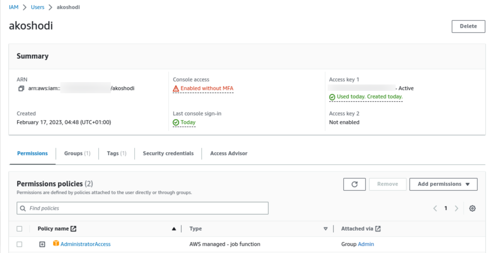

# Week 0 — Billing and Architecture
## Required Homework
- Recreate Conceptual Diagram in Lucid Charts
- Recreate Logical Architectural Diagram in Lucid Charts
### Create an Admin User
Created an a group with **AdministratorAccess** policy and added an admin user named **akoshodi** to the group

- Use CloudShell
- Generate AWS Credentials
- Installed AWS CLI
- Create a Billing Alarm
- Create a Budget
