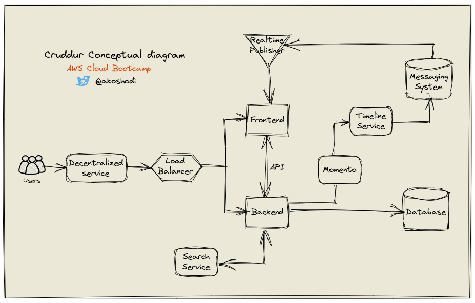
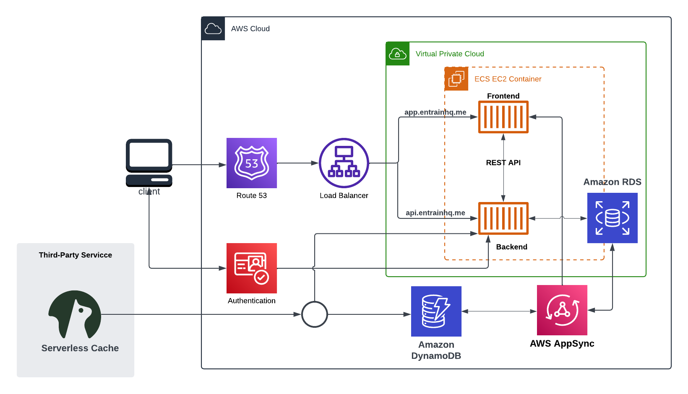
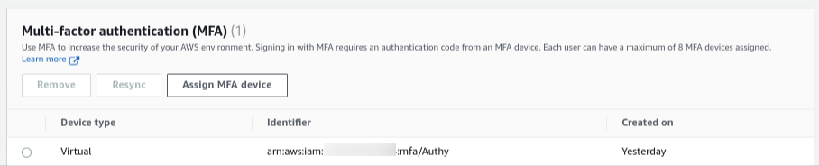
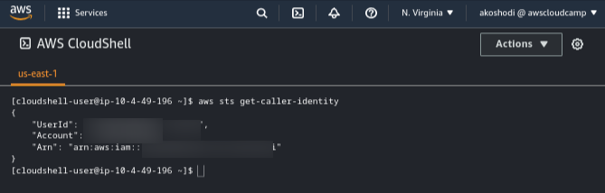
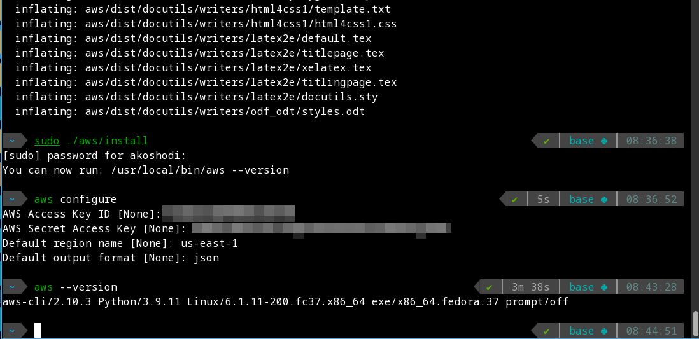
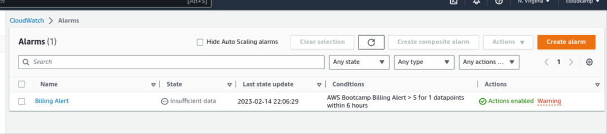
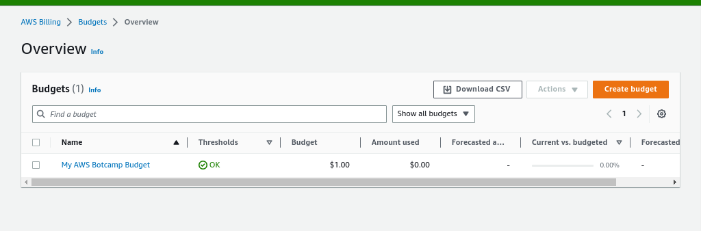

# Week 0 — Billing and Architecture
## Required Homework
- Conceptual Diagram of Cruddr


### Logical Architectural Diagram of Cruddr in Lucid Charts


[Link to diagram in Lucid Chart](https://lucid.app/lucidchart/e9d65cd0-bcde-4bb9-bb4c-e0d80bf850d5/edit?invitationId=inv_95c55684-d266-439f-8ed9-adaac01ea9ef)

## :cloud: AWS
### Generate AWS Credentials


### Create an Admin User
Created an a group with **AdministratorAccess** policy and added an admin user named **akoshodi** to the group


### Use CloudShell


### Installed AWS CLI
Decided to install and configure the AWs CLI on my local environment (Linux) after successfully installing via gitpod. In followed intructions on the AWS documentation pages below
- [Installing or updating the latest version of the AWS CLI](https://docs.aws.amazon.com/cli/latest/userguide/getting-started-install.html)
- [Configuration basics - AWS Command Line Interface](https://docs.aws.amazon.com/cli/latest/userguide/cli-configure-quickstart.html)
```
$ curl "https://awscli.amazonaws.com/awscli-exe-linux-x86_64.zip" -o "awscliv2.zip"
$ unzip awscliv2.zip
$ sudo ./aws/install
```

```
$ aws configure
AWS Access Key ID [None]: *********************
AWS Secret Access Key [None]: ******************************************
Default region name [None]: us-east-2
Default output format [None]: json
```




### Create a Billing Alarm



### Create a Budget
I created a budget with a limit of $1




## Homework Challenges
